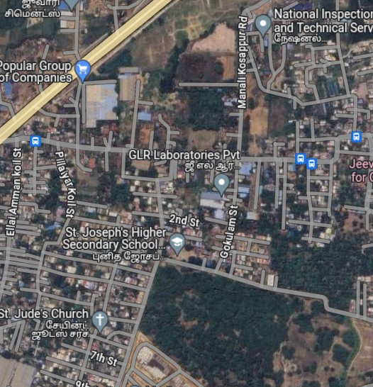
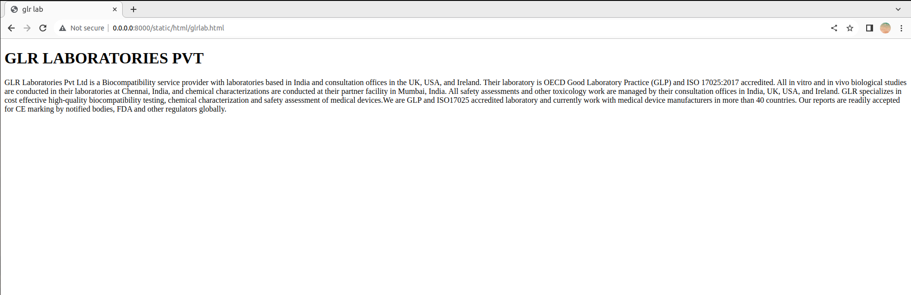
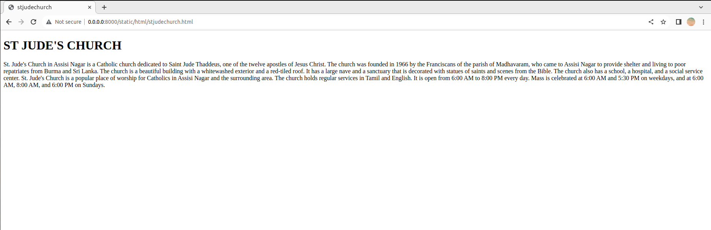
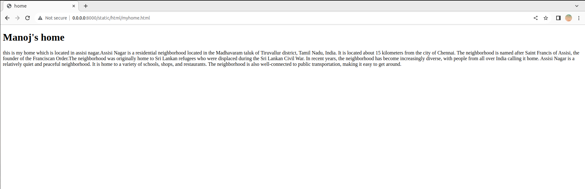
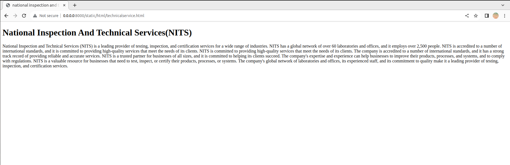

# Places Around Me
## AIM:
To develop a website to display details about the places around my house.

## Design Steps:


### Step 1:
clone the github repository into the IDE

### Step 2:
create a django project

### step 3:
write the needed HTML code

### step 4:
run the django server and excute the HTML files


## Code:
## map.html code:
```html
<!DOCTYPE html>
<html>
    <head>
        <title>
            imagemaps demo
        </title>
    </head>
    <body>
        <h1> MAP OUTPUT</h1>
        
        <map name="image_map">
            <area alt="stjosephschool" title="stjosephschool" href="stjosephschool.html" coords="268,334,44" shape="circle">
            <area alt="stjudechurch" title="stjudechurch" href="stjudechurch.html" coords="159,443,42" shape="circle">
            <area alt="technicalservice" title="technicalservice" href="technicalservice.html" coords="348,19,391,56" shape="rect">
            <area alt="glrlab" title="glrlab" href="glrlab.html" coords="289,243,327,283" shape="rect">
            <area alt="myhome" title="myhome" href="myhome.html" coords="338,369,356,388" shape="rect">
        </map>
    </body>
</html>
```

## glrlab.html code:
<!DOCTYPE html>
<html>
    <head>
        <title>
            glr lab
        </title>
    </head>
    <body>
        <h1>GLR LABORATORIES PVT </h1>
        <P>
            GLR Laboratories Pvt Ltd is a Biocompatibility service provider with laboratories based in India and consultation offices in the UK, USA, and Ireland. Their laboratory is OECD Good Laboratory Practice (GLP) and ISO 17025:2017 accredited. 
            All in vitro and in vivo biological studies are conducted in their laboratories at Chennai, India, and chemical characterizations are conducted at their partner facility in Mumbai, India. All safety assessments and other toxicology work are managed by their consultation offices in India, UK, USA, and Ireland.
            GLR specializes in cost effective high-quality biocompatibility testing, chemical characterization and safety assessment of medical devices.We are GLP and ISO17025 accredited laboratory and currently work with medical device manufacturers in more than 40 countries. 
            Our reports are readily accepted for CE marking by notified bodies, FDA and other regulators globally.
        </P>
    </body>
</html>

## myhome.html code:
<!DOCTYPE html>
<html>
    <head>
        <title>
            home
        </title>
    </head>
    <body>
        <h1>Manoj's home</h1>
        <p>
            this is my home which is located in assisi nagar.Assisi Nagar is a residential neighborhood located in the Madhavaram taluk of Tiruvallur district, Tamil Nadu, India. It is located about 15 kilometers from the city of Chennai.
            The neighborhood is named after Saint Francis of Assisi, the founder of the Franciscan Order.The neighborhood was originally home to Sri Lankan refugees who were displaced during the Sri Lankan Civil War.
            In recent years, the neighborhood has become increasingly diverse, with people from all over India calling it home. Assisi Nagar is a relatively quiet and peaceful neighborhood. It is home to a variety of schools, shops, and restaurants. The neighborhood is also well-connected to public transportation, making it easy to get around.
            
</p>
</body>
</html>

## stjosephschool.html code:
<!DOCTYPE html>
<html>
    <head>
        <title>
            stjosephschool
        </title>
    </head>
    <body>
        <h1>ST JOSEPH MATRICULATION HIGHER SECONDARY SCHOOL</h1>
        <P>

         St. Joseph's Higher Secondary School is a co-educational private school located in Assisi Nagar, Madhavaram, Chennai, Tamil Nadu, India. 
         The school was founded in 1966 by the Sisters of St. Joseph of the Apparition, a Roman Catholic religious congregation. The school is affiliated to the Tamil Nadu State Board of Education and offers education from kindergarten to higher secondary level.
         The school's motto is "Education for Life" and it aims to provide students with a holistic education that will help them to develop their intellectual, social, emotional, and spiritual potential. The school has a strong academic record and its students have consistently performed well in board examinations.
         The school has a well-qualified and experienced teaching staff. The school also has a number of facilities, including a library, a computer lab, a science lab, a playground, and a sports field.
         
</P>
</body>
</html>

## stjudechurch.html:
<!DOCTYPE html>
<html>
    <head>
        <title>
            stjudechurch
        </title>
    </head>
    <body>
        <h1>ST JUDE'S CHURCH</h1>
        <P>

        St. Jude's Church in Assisi Nagar is a Catholic church dedicated to Saint Jude Thaddeus, one of the twelve apostles of Jesus Christ. 
        The church was founded in 1966 by the Franciscans of the parish of Madhavaram, who came to Assisi Nagar to provide shelter and living to poor repatriates from Burma and Sri Lanka.
        The church is a beautiful building with a whitewashed exterior and a red-tiled roof. It has a large nave and a sanctuary that is decorated with statues of saints and scenes from the Bible. The church also has a school, a hospital, and a social service center.
        St. Jude's Church is a popular place of worship for Catholics in Assisi Nagar and the surrounding area. The church holds regular services in Tamil and English. It is open from 6:00 AM to 8:00 PM every day. Mass is celebrated at 6:00 AM and 5:30 PM on weekdays, and at 6:00 AM, 8:00 AM, and 6:00 PM on Sundays.
</P>
</body>
</html>

## technicalservice.html:
<!DOCTYPE html>
<html>
    <head>
        <title>
            national inspection and technical service
        </title>
    </head>
    <body>
        <h1>National Inspection And Technical Services(NITS)</h1>
        <p>
            National Inspection and Technical Services (NITS) is a leading provider of testing, inspection, and certification services for a wide range of industries. NITS has a global network of over 60 laboratories and offices, and it employs over 2,500 people.
            NITS is accredited to a number of international standards, and it is committed to providing high-quality services that meet the needs of its clients.
            NITS is committed to providing high-quality services that meet the needs of its clients. The company is accredited to a number of international standards, and it has a strong track record of providing reliable and accurate services.
            NITS is a trusted partner for businesses of all sizes, and it is committed to helping its clients succeed.The company's expertise and experience can help businesses to improve their products, processes, and systems, and to comply with regulations.NITS is a valuable resource for businesses that need to test, inspect, or certify their products, processes, or systems. The company's global network of laboratories and offices, its experienced staff, and its commitment to quality make it a leading provider of testing, inspection, and certification services.
</p>
</body>
</html>
```

## Output:
### map output:

### glrlab output:

### school output:

### church output:

### home output:

### nits output:



## Result:
The program is executed successfully.
